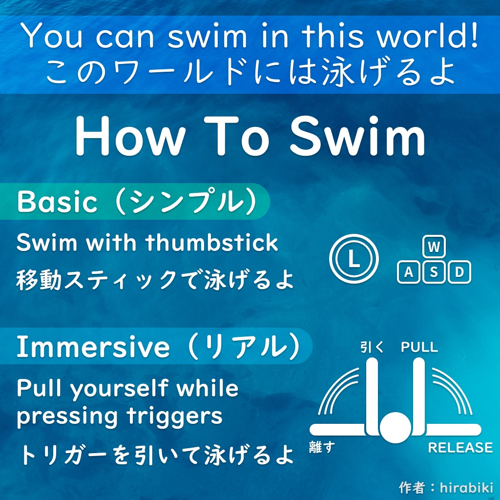

# Master_Work_In_Progress
#### Documentation of my Master project

This journal documents my journey in choosing and exploring a project idea for my 2025 Master's project in head media design.

###### navigation

1. [2024-12-10](#2024-12-10) First-day ideas
2. [2024-12-16](#2024-12-16) Sport design/sketches
3. [2024-12-17](#2024-12-17) Preparations for test day
4. [2024-12-18](#2024-12-18) Test day
5. [2025-01-08](#2025-01-08) Poster / concept art
6. [2025-01-09](#2025-01-09) Workplace set up
7. [2025-01-13](#2025-01-13) VRChat for testing
8. [2025-01-15](#2025-01-15) First VRChat test
9. [2025-02-01](#2025-02-01) VRchat volleyball inspiration
10. [2025-02-04](#2025-02-04) //Alternative idea//
11. [2025-02-13](#2025-02-13) VRChat Water study
12. [2025-02-20](#2025-02-20) Underwater filming in the lake
13. [2025-02-25](#2025-02-25) Mid-Crit presentation
14. [2025-02-26](#2025-02-26) VR physical rigs and other physical devices
15. [2025-02-27](#2025-02-27) Links for future references
16. [2025-02-28](#2025-02-28) More refs from tutor
17. [2025-03-03](#2025-03-03) VRC player rotation
18. [2025-03-22](#2025-03-22) VRC Finball - playtest 0.1
19. [2025-03-25](#2025-03-25) On Echo Arena
20. [2025-04-03](#2025-04-03) Technical difficulties
21. [2025-04-04](#2025-04-04) How to Log
22. [2025-04-09](#2025-04-09) Planning / Making lists
23. [2025-04-15](#2025-04-15) Cave Environement
24. [2025-04-16](#2025-04-16) Mid-crit feedback
25.  Link Title
26.  Link Title
27.  Link Title
28.  Link Title
29.  Link Title
   

  
###### 2024-12-10
## First day ideas

##### VR Sport game
I'd like to make an innovative Sports game for VR.
 
- On VRCHAT? 
	 High latency but very social and accessible
	 
- With FBT? 
	Good for innovation but not that many people have FBT
	 
- New locomotion system? 
	With insights from the locomotion vault
	
- Physical installation (harness tied to the roof) 
	FUN! Not release-ready but good for the exhibition context.
 
I am thinking that for the exhebition I'd like to have a FBT phisical instalation but I could also develop a version for standalone VR users on VRchat....
Depends how the game will be designed...
 
Test day Ideas:
- Try having people play the sport IRL with paper ball/paper props
- Prototype barebone mechanics in unity to test with VR
- Get others to try the harness (if it's safe enough)
- Do field research, asking people about what sports the like and why
 

To do
- [ ] Publish and host the exergame vault to ref existing VR sports games
- [x] Add a VRchat tag and gather examples of VRchat worlds for exercising.
- [x] Sketch initial sport mechanics ideas (as many as possible)

- [x] Analyse why I like football so much.
- Because in solo sports i have no motivation to win, I need to play with a team in games that requires teamwork, like football and volleyball.
- [ ] Test the harness setup in class (get climbing ropes)!

 

I like the fish people idea

(from Zelda breath of the wild)

[Back to navigation](#navigation)
 
 
###### 2024-12-16
## Sport design / sketches

[Back to navigation](#navigation)
 
 

###### 2024-12-17
## Preparations for test day

In a fairly large area, about 5x4m, there will be goals on each side, a ball, and color-coded players. Hopefully, there will be three players on each team.

[Back to navigation](#navigation)
 
 
###### 2024-12-18
## Test day

We tested playing a physical version of FinBall with paper props.

3 versus 3, area of 6x3m approximately.

It worked well and was fun; the pace had to be slowed because of the small space (small steps).

The teams wanted to take a team picture before the game = team pic feature!
(it reminds me of vrchat volley that gives you pictures of you playing at the end of the game, and they are local, so each player gets pictures of themselves playing)

Because it worked so well and people enjoyed the physicality, making an AR game has been suggested. I like the Idea, but we would lose the 3d space and such. It would be a very different sport but still enjoyable. Eventually, I would like to make a team AR game that is meant to be played in a large space eventually.

I tried to emulate the "currents" element that randomly pushes people, and It was well received; it seems to make for a fun, unpredictable element.

The teams naturally and quickly started quick-passing to teammates and making strategies while trying to position themselves better, assigning defence and attack ect...

The slow pace and FreezeTag element worked in encouraging team play.

 
##### Afternoon
I had to test quickly, but it was a lot of fun for the players again. They liked being restricted in speed, which they thought was fun. They liked the idea of the fish being alive and moving independently when it's not held or thrown. 

Someone asked if, in the ocean setting, the frozen people would "drown" or, more like, drop to the bottom slowly because they're not swimming anymore. I thought it was interesting.
That Idea made me think about how being frozen is a bit like being electrified/stunned so... The characters could look like Eels... A few ocean creatures have interesting defence mechanisms: Eels, jellyfish, the inflated fish guy, etc... I want to look into that for the design.

They also wondered how you hold the ball if you're swimming and how the physics will differ in VR because it's underwater physics.

I tested being frozen for 5 sec vs 10 sec, and it seemed too boring to be stuck for 10 sec. In that setting, the timer worked better than being touched by a teammate because it was hard to know if we were being touched.

But everyone enjoyed the game and some other students wanted to try it too so it seemed to have sparked interest.

[Back to navigation](#navigation)
 
 

###### 2025-01-08
## Poster / concept art

I thought the poster would be a good occasion to visualize what I imagine the "fish people avatars" to look like while they play under water.

[Back to navigation](#navigation)
 
 

###### 2025-01-09
## Workplace set up

For working and prototyping in VR I will need:
- [x] strong Windows PC (brought my own to class)
- [x] Rooter (borrowed from media design)
- [x] 4g sim card (because the school internet is too restrictive, brought my own)
- [x] quest 3 (borrowed from medias design)
- [x] quest 3 accessories for confort (brought my own quest strap)

[Back to navigation](#navigation)
 
 

###### 2025-01-13
## VRChat for testing

I've been looking into the [udon sharp documentation](https://udonsharp.docs.vrchat.com/) to see if i could make a Swimming system for moving in VR and it seems possible so I decided to prototype it in VRChat.

The point of VRchat is that I can get my online friends to test it directly in-game, with their VR, from wherever they live and I can record their feedback or reactions in the game.

[Back to navigation](#navigation)
 
 

###### 2025-01-15
## First VRChat test

I've uploaded a test world into VRChat with the swimming code I had been working on, I then invited my friends to test it with their VR on the vrchat platform. It worked quite well.

Here it is, anyone can enter it in VRChat but it doesn't work without VR.
[LINK](https://vrchat.com/home/world/wrld_9b2e67e2-929f-4852-b324-bcac24cf545a/info)

- to swim you had to "push water" with you palms
- I added a ball to test throwing it to friends
- there were some gray spheres that turn yellow if you activate them, the idea is that you can swim to each sphere to activate it, to test/practice swimming.
- 4 people were able to join and test, they are all used to VR and play vrchat regularly.

Feedback
- it works to swim with the traditional swimming movement but people were quickly drawn to a simpler move of waving their hands in the direction they want to swim.
- one issue I'll have to fix is that when people loose tracking they get "ejected" far away, since the code calculates the differance in hand position frame to frame. if the hand gets teleported it means that distance was big and it will apply a big movement force.
- The same applies to the "respawn" action.

Overall the swimming was very fun to use, and it didn't cause too much sickness because of how the players stay upright and don't rotate upside down

Some additional observations
- we could not throw the ball very far, I will need to reduce the drag or up the force applied.
- the networking was laggy for the ball because i was not updating the position each frame
- when we reach to grab the ball, the palm faces the ball and so it makes us swim away from the ball

To do for the next test:
- fix the yeeting when teleporting/loosing tracking
- Make it so we can activate/ disactivate a swimming mechanic. so that I could have several versions of the swimming in the test world and we can compare them.
- code some other versions of swimming like one with rotation
- Fix the ball, network, reaching, speed/drag
- creat a "game area"
- build and publish a "Fish-person" avatar and make it avaliable in the world
- prototype a "goal" that shows point when the ball goes through

[Back to navigation](#navigation)

 
 

###### 2025-02-01
## VRchat volleyball inspiration

I've played this volleyball game in vrchat with my friends and it was super fun !

-> usually games in vrchat have a latency issue but the creator found solutions that worked really well. I will need to find similar tricks for my game to work on VRchat.

That's what the creator said when I asked her on twitter.

[Back to navigation](#navigation)

 
 

###### 2025-02-04
## //Alternative idea//
After the discussion with Douglas an other project idea came up and I'm just putting it here for reference.

The idea would be to start from specific muscle training movements, and make VR mini-games around those moves, 1 game per 1 training exercise. also would be cool to do that with rehabilitation.
An other way to gamify exercising...

Anyway moving on !

[Back to navigation](#navigation)

 
 

###### 2025-02-13
## VRChat Water study

I looked around in VRChat worlds at how people have made swimming more immersive.

Video link:

*Click the image to view the video*

Notes:
- blur at distence
- atmospheric color (whiter/bluer at distence) / blue tint
- CAUSTICS ! (light textures)
- light beams
- water noises
- muted/ echoey voices
- whale noises and such in the background
- lots of small fish swimming randlomly
- tall weed
- corail and sea plants
- Jellyfish !
- big rays
- splach noises, when swiming or jumping in water
- tiny bubbles when moving
- bubbles coming up from the sand
- slow movements, in the plants and particules

[Back to navigation](#navigation)

 
 

###### 2025-02-20
## Underwater study in lake Geneva

*Click the image to view the video*

I threw my phone in the lake while filming, here are my observations:

### How the Underwater audio feels
Underwater, sound is muted but not weak: strong in the low end but lacking sharpness. It feels engulfing, with no clear direction, as if the sound wraps around you. There’s a thickness to it, like it’s being pushed through a dense medium.

### Recreating Underwater Soundscapes

**Attenuation** - High frequencies fade as sound travels.

**Refraction** - Sound bends due to water temperature and pressure changes.

**Absorption** - High frequencies disappear faster than low ones.

**Impedance mismatch** - Water transmits sound differently than air, altering perception.

**Non-directionality** - Sound seems to come from everywhere.

**Low-pass filtering** - High frequencies are reduced, leaving deep, muffled tones.

**Reverberation** - Continuous, diffused echoes rather than distinct reflections.

### Caustics
it was really cool to see how the caustics look in the real world. you can see how the shape of the water surface bends the light into moving patterns, and the color spectrum.

### Particles
I was able to study how the particles move and show the movement of the water. We can't really see the water movement but i was suprised to see that there are always particles making the flow visible.

### Reflections
the surface had a reflection of the bottom like a mirror.

### Light beams
The side of the sun had those light beams, subtle but mery much there. it looks beautiful.

### distance fade
in all the scenes without exeptions you can only see what's relatively close, as things ger further they fade into the color of the water.

### Colour swab
$\color{#4AA1BB}{\text{■}}$ blue $\color{#1680A1}{\text{■}}$ bottom blue $\color{#5C95CB}{\text{■}}$ surface blue $\color{#8DBDDB}{\text{■}}$ another surface blue $\color{#8DBDDB}{\text{■}}$ light beams $\color{#59B6BC}{\text{■}}$ murkier waters $\color{#81E5FF}{\text{■}}$ sky blue $\color{#2BC4D8}{\text{■}}$ water blue $\color{#125747}{\text{■}}$ algeas $\color{#627A3F}{\text{■}}$ $\color{#1E3823}{\text{■}}$ other algeas $\color{#589E8C}{\text{■}}$ greenish waters $\color{#59A879}{\text{■}}$ the ground/sand $\color{#54BEAF}{\text{■}}$ water above

$\color{#4AA1BB}{\text{■}}$ $\color{#1680A1}{\text{■}}$ $\color{#5C95CB}{\text{■}}$ $\color{#8DBDDB}{\text{■}}$ $\color{#8DBDDB}{\text{■}}$ $\color{#59B6BC}{\text{■}}$ $\color{#81E5FF}{\text{■}}$ $\color{#2BC4D8}{\text{■}}$ $\color{#125747}{\text{■}}$ $\color{#627A3F}{\text{■}}$ $\color{#1E3823}{\text{■}}$ $\color{#589E8C}{\text{■}}$ $\color{#59A879}{\text{■}}$ $\color{#54BEAF}{\text{■}}$

[Back to navigation](#navigation)

 
 

###### 2025-02-25
## Mid-Crit presentation
*Wednesday 26.02 - 15h20*

### Finball VR: An Underwater Team Sport for Virtual Reality

"Finball VR" is a project focused on developing a new VR swimming locomotion system for a team-based underwater sport.

The goal is to create an immersive and enjoyable experience where players can engage in social, competitive gameplay within a virtual aquatic environment. 

By exploring innovative locomotion techniques and experimenting with DIY physical devices, the project aims to improve the immersion and movement of players. 

Additionally, it will explore the potential of VRChat as a platform for social sports, despite its limitations, allowing for interactions and community. 

The project addresses the challenge of creating a fluid, natural movement system for VR, particularly in team sports settings, as well as designing a new sport specifically with VR’s advantages and limitations in mind.

[Back to navigation](#navigation)

 
 

###### 2025-02-26
## VR physical rigs and other physical devices

I've had a lot of interest in VR rigs for a long time but none of them seemed that good.
I don't pretend I could find a solution, but in my case, which is specific to swimming, It would be interesting to design some kind of physical instalation to make the swimming more immersive.

This guy's "weightless machine" would be my dream:

[Link to video](https://www.youtube.com/watch?v=gSDtNkKPiDg)

_______________________
Here are images of physical devices that are used in medical applications such as rehabilitation.

However, i felt uneasy Researching those because some of these people cannot walk or move in real life and im out here trying to move in VR with devices when I could simply do all those movements in real life without aid? Feels a little disrespectful.

And a rig would not be compatible with mass adobtion/accesibility of my game, however it's still interesting to look into. The game should be designer to play without it but should be compatible with it if I get interesting results.

With a rig I would want to add feet trackers but that would be a bother to gear up someone for an exhibition setting. Peharps some other tracking solution could work for this like AI body traking via video, if filming from underneath. it could be part of the device and seamless for users.

A physical device however is also a lot of work and I doubt I could do both the device and the game....

I should focus on the game first.

If I manage to make the game fast and simple I could do the physical stuff :-)

[Back to navigation](#navigation)

 
 

###### 2025-02-27
## Links for future references
Fading at distance effect:
I found this shader for a vrchat compatible performent fog
https://github.com/frostbone25/Unity-Baked-Volumetrics

Collection of all the useful links for VRChat dev:
https://github.com/madjin/awesome-vrchat

Caustics:
https://booth.pm/en/items/3666514
(1,200 JPY so about 7.21 Swiss Franc)

fins:
https://booth.pm/en/items/5429910

VRC swimming:
https://hirabiki.booth.pm/items/2127684

world to visit:
https://vrchat.com/home/world/wrld_c87d9e7a-d46a-4ca4-9077-a6322ac0f7e7/info
(smash contest, a smashing game)

underwater effects:
https://booth.pm/en/items/3263895

<<<<<<< Updated upstream

[Back to navigation](#navigation)
 
 

###### 2025-02-28
## More refs from tutor

All about shaders !!!!

https://thebookofshaders.com/11/

Decals in URP

https://docs.unity3d.com/Manual/urp/renderer-feature-decal.html

"optical flow"

[google imgs](https://www.google.com/search?sca_esv=3d212cfe0cf3ba87&sxsrf=AHTn8zqLA5y_04by_vb9mUU7jfXmeUWjvg:1740749770727&q=optical+flow&udm=2&fbs=ABzOT_CWdhQLP1FcmU5B0fn3xuWpA-dk4wpBWOGsoR7DG5zJBr1qLlHFB6ZBcx-Arq68_wfw0s-Sy4efUF8x4O2idyUNAprOOrIICDwexO1MWoIv7y7QMR7c9fXxemwV4Ccx7a8BdNJVxmdVJER700ZPKc1-FYb8sDDNVZHd4jXU9MyXJ2pyB9VwEjlLiihT6V8D0LRV92eC&sa=X&sqi=2&ved=2ahUKEwj5geidvuaLAxUfhf0HHfQ6KuUQtKgLegQIERAB&biw=1470&bih=798&dpr=2)

[Back to navigation](#navigation)
 
 

###### 2025-03-03
## VRC player rotation

I was struggling to make a swimming mechanism in which you can rotate upside down, but then I found out that you simply canot rotate the player in VRC.
however, there are ways as usual and what people seem to be doing is making the player "sit" on a rigidbody. and that rigidbody can rotate.

I found that out on this guy's page about a 0 gravity system.

https://tokiwa-carlo.booth.pm/items/5596315

Translation: 

■ Mechanism:
Essentially, it’s just allowing you to sit on a Rigidbody that doesn’t experience gravity or air resistance.
In addition, it follows the colliders of your hands and feet so you can interact with walls and other objects.

His way of interacting with wall is interesting too. when swimming you should be able to push yourself on objects too

[Back to navigation](#navigation)
 
 

###### 2025-03-24
## VRC Finball - playtest 0.1

*Click the image to view the video*

### Observations
First reactions to swimming:  
"wooow"   
"I hate that"   
"weeeeee"

After a bit:   
"ooOOoooh I get it now"   
"I smashed my microphone again"   
"I'll need to stand up for this"

- since I desactivated swimming for the limb near the ball, you can only use 1 hand for swiming when you are holding the ball. I don't mind it however because the player should pass
- It is indeed very difictult to aim so I should add some kind of aim assist
- someone said it's awkward when they want to move their arms but dont want to move, then someone else said there could be a toggle but then it would kind of ruin it.
- I quickly forgot which goal was mine and which one i needed to aim to.
- The player with a bigger avatar was swimming much faster because of arm lengh 
- Players were quickly exhausted, I need to better encourage passing or make the arena smaller. Aim assist should make passing easier. 
- If I teleport players to a position they will start the game well placed and it might encourage positioning.(otherwise, all players go to the ball in a cluster)
- A friend mentioned "echo VR" when I explained the game, then he mentioned "Quiddich" because of the "ball moving on its own" idea.

  

### To do next
1. create a opt-in system to make the teams
2. Non-VR version of swimming
3. players need a visual cue to differentiate the teams
4. visual cue of which goal is who's
5. I'll need to make sure that all players can reach the same speed with effort, regardless of avatar size
6. teleport players to start position
7. start countdown or visual cue
8. holding the ball lets you score continually without the ball respawning- needs fixing
9. the goal's visual cue was not global, needs fixing
10. Aim Assist!
11. Start adding sound! a way for players to add music while waiting for soundscape because having no sound feels weird
12. sound cues for goals and countdowns
13. Adding obsticles and basic external forces for testing, currents, algea...
14. implementing "freeze tag". pehaps different versions

[Back to navigation](#navigation)
 
 

###### 2025-03-25
## On Echo Arena

There's a community reviving the game, and through tiktok videos they ended up getting more users in the discord comunity than what the original discord had. 

This VR Sport is special and it continues to grow in popularity even post-Shutdown.

Right Now they have 38'988 members and it's growing everyday.

I did manage to join an echo game through their system and I tried to talk to people in the echo discord and in-game but it was not succesfull... No one was in a talking mood, I might try again an other time.

### New VR Sports to try
I looked for new games and I found a few VR sports that I haven't tried yet
1. Home Sports (AR sport games)
2. Yeeps: Hide and Seek (Looks to have a horrible community of kids bullying others)
3. CleanSheet Football (goal keeper)
4. Spinball: 360 Tennis (AR game)
5. STARWAVE 
6. Clawball (quite close to my project....)

### Why VRChat
These games look great and really fun to play with friends. But most of them cost money and for me to play with my friends i would need: 
- for my friends to be interested in the same game
- for them to have a meta headset (most games are not cross-platform)
- for everyone to have the budjet to buy the game
- for them to be willing to buy it
- for us to play at the same time ?
- limited space on device for all the games

While VRChat:
- free
- easy cross-platform
- even has a non-vr version which will be mobile compatible soon.
- multiplayer by default
- everyone's already on the platform and we can invite friends ingame
- no need to buy or download 300 games

### The quest kids problem
since the launch of the meta quest 2, which was affordable and got gifter to a lot of kids for christmas, A loooot of comunities got ruined because a lot of kids play and throw insults everywhere (which is also very dangerous for people this age who should not talk to adults online). One way to solve this is to have an option for  18+ instences, as well as an option for private instenses where you invite your friends. VRChat has those options built in thankfully. and you can publish world without quest(android) support which already filters out a lot of children but it also means that only people who have a gaming pc can play.

[Back to navigation](#navigation)
 
 

###### 2025-04-03
## Technical difficulties

Spent a while trying to rotate that VRC station componant but eventually I got it. I felt like a wast of time but actually it was nessecary to go through this to understand better the VRChat api and specifically the VRC station. I knew i would have to get involved with the technical part / maths and general logic at some point, but I enjoy it so it's been rather fun.

[Back to navigation](#navigation)
 
 

###### 2025-04-04
## How to Log
One thing that was slowing me down is that i could not see any console or log when testing in VR, because it opens VRChat and it doesnt log in the unity console.
Now there are ways to display logs in VRChat but it looks weird and it did not have the informations I needed.

I ended up displaying custom log messages In a Log board display that I put in the scene, So that I can Read all my troubleshooting messages direcly within VR when testing.

[Back to navigation](#navigation)
 
 

###### 2025-04-09
## Planning / Making lists

I need a list of all the things I want to do.

**Game setup**
- Mechanic for opting in (to play)
- mechanic for team making
- color coding teams, visual clue of which team the player is on

**Gameplay**
- aiming aid (target clue, player target selection, "concentration" effect?, aim line ?)
- freeze tag player effects on player
- unfreeze or timer ?
- Ball autonomous mouvements (fish ball)

**Feedback**
- sound feedback when swimimng for better movement understanding
- particule effect as movement clue
- Visual/sound feedback on buttons
- visual/sound feedback when scoring (environmental change?)

**General audio**
- spacial sound effects on voices
- general soundscape

**Environment**
- cave/rocks as aera limitation / game field
- immersion-scape: particules, colors and distance fade
- enviromental effects on player (currents)
- static enviromental obstacles (algea, rocks)
- moving enviromental obstacles (big fish/ray/turtle)

I think I should have done all this in about one month, with only fine-tuning and presentation prep left.

**Without counting holidays, that makes it mid-may, 16-19 of may.**

This list shows a good order of importance: game setup and gameplay are indispensable, feedback and audio are very important, and the environment must be wrapped up at the end.

During production, regular and thorough testing is required. Testing will happen alongside production with documentation.

[Back to navigation](#navigation)
 
 

###### 2025-04-15
## Cave Environement

I need to somehow limit the game area and I need the environment to fit the underwater aesthetic while being itself a game element influancing where the ball bounces.

I've decide to make an underwater cave, round for the gameplay and with uneven surfaces for when the ball bounces on it.

it needs some light so there's an opening at the top, with the sun shining through ( underwater) that way i can add lightrays later

I was able to make a shape im satified with but it's not textured properly yet.

 (this is the avatar that i use in vrchat while testing, just because it's cute)

There's a starter area on the side with access to the game area, it's that rectangle in the wall.

I've changed a bit the colors and such to start making the environment match my research findings

[Back to navigation](#navigation)
 
 

###### 2025-04-16
## Mid-crit feedback

Alexia: **no caves**

She pointed out that she wanted the feeling of being in the ocean and the rocky cave is very restrictive and isolating, like being stuck in a room. It made her sad.

I agreed when she said it and then i realised that the cave would also make it impossible for big fishes or turtles to fly by as obsticles.

So I was thinking, but how can I limit the game area then ? to keep the ball from going too far.

With the disscution during midcrit it's been pointed out that it doesnt have to be part of the natural environment, It could be lines or cartoony ui, partly transparent at least, a net, maybe it only appears when things get close. 

**It should be very subtle so that it doesn't impact the feel of the open sea.**

### Advices:
- DO NOT LOOSE THE QUIRKINESS
- don't get caught up in the stress of producing sacrifying the unique style and properties of this project.
- careful not get lost in technical details

This discussion was very useful and I realised that I need to focus quickly on the visuals and immersive environment, as douglas had pointed out as well. 

I want to creat assets (algea vines, rocks, corals, crabs, aquatic plants) by modeling them by hand in VR with adobe modeler, so that it'll have my unique style --> hand-made (its also easier for me to model in VR).

[Back to navigation](#navigation)
 
 

###### 2025-04-
## New list of priority?

1. Base environment
2. movement feedback (bubbles,water noises)
3. feedback on game elements (sound,visual,haptic)
4. team opt-in mechanic 
5. Aiming aid
6. fog and lighting
7. soundscape
8. 
