# Master_Work_In_Progress
#### Documentation of my Master project

This journal documents my journey in choosing and exploring a project idea for my 2025 Master's project in head media design.

###### navigation

1. [2024-12-10](#2024-12-10) First-day ideas
2. [2024-12-16](#2024-12-16) Sport design/sketches
3. [2024-12-17](#2024-12-17) Preparations for test day
4. [2024-12-18](#2024-12-18) Test day
5. [2025-01-08](#2025-01-08) Poster / concept art
6. [2025-01-09](#2025-01-09) Workplace set up
7. [2025-01-13](#2025-01-13) VRChat for testing
8. [2025-01-15](#2025-01-15) First VRChat test
9. [2025-02-01](#2025-02-01) VRchat volleyball inspiration
10. [2025-02-04](#2025-02-04) //Alternative idea//
11. [2025-02-13](#2025-02-13) VRChat Water study
12. [2025-02-20](#2025-02-20) Underwater filming in the lake
13. [2025-02-25](#2025-02-25) Mid-Crit presentation
14. [2025-02-26](#2025-02-26) VR physical rigs and other physical devices
1.   Link Title
2.   Link Title
3.   Link Title
4.   Link Title
5.   Link Title
6.   Link Title
   

  
###### 2024-12-10
## First day ideas

##### VR Sport game
I'd like to make an innovative Sports game for VR.
 
- On VRCHAT? 
	 High latency but very social and accessible
	 
- With FBT? 
	Good for innovation but not that many people have FBT
	 
- New locomotion system? 
	With insights from the locomotion vault
	
- Physical installation (harness tied to the roof) 
	FUN! Not release-ready but good for the exhibition context.
 
I am thinking that for the exhebition I'd like to have a FBT phisical instalation but I could also develop a version for standalone VR users on VRchat....
Depends how the game will be designed...
 
Test day Ideas:
- Try having people play the sport IRL with paper ball/paper props
- Prototype barebone mechanics in unity to test with VR
- Get others to try the harness (if it's safe enough)
- Do field research, asking people about what sports the like and why
 

To do
- [ ] Publish and host the exergame vault to ref existing VR sports games
- [x] Add a VRchat tag and gather examples of VRchat worlds for exercising.
- [x] Sketch initial sport mechanics ideas (as many as possible)

- [x] Analyse why I like football so much.
- Because in solo sports i have no motivation to win, I need to play with a team in games that requires teamwork, like football and volleyball.
- [ ] Test the harness setup in class (get climbing ropes)!

 

I like the fish people idea

(from Zelda breath of the wild)

[Back to navigation](#navigation)
 
 
###### 2024-12-16
## Sport design / sketches

[Back to navigation](#navigation)
 
 

###### 2024-12-17
## Preparations for test day

In a fairly large area, about 5x4m, there will be goals on each side, a ball, and color-coded players. Hopefully, there will be three players on each team.

[Back to navigation](#navigation)
 
 
###### 2024-12-18
## Test day

We tested playing a physical version of FinBall with paper props.

3 versus 3, area of 6x3m approximately.

It worked well and was fun; the pace had to be slowed because of the small space (small steps).

The teams wanted to take a team picture before the game = team pic feature!
(it reminds me of vrchat volley that gives you pictures of you playing at the end of the game, and they are local, so each player gets pictures of themselves playing)

Because it worked so well and people enjoyed the physicality, making an AR game has been suggested. I like the Idea, but we would lose the 3d space and such. It would be a very different sport but still enjoyable. Eventually, I would like to make a team AR game that is meant to be played in a large space eventually.

I tried to emulate the "currents" element that randomly pushes people, and It was well received; it seems to make for a fun, unpredictable element.

The teams naturally and quickly started quick-passing to teammates and making strategies while trying to position themselves better, assigning defence and attack ect...

The slow pace and FreezeTag element worked in encouraging team play.

 
##### Afternoon
I had to test quickly, but it was a lot of fun for the players again. They liked being restricted in speed, which they thought was fun. They liked the idea of the fish being alive and moving independently when it's not held or thrown. 

Someone asked if, in the ocean setting, the frozen people would "drown" or, more like, drop to the bottom slowly because they're not swimming anymore. I thought it was interesting.
That Idea made me think about how being frozen is a bit like being electrified/stunned so... The characters could look like Eels... A few ocean creatures have interesting defence mechanisms: Eels, jellyfish, the inflated fish guy, etc... I want to look into that for the design.

They also wondered how you hold the ball if you're swimming and how the physics will differ in VR because it's underwater physics.

I tested being frozen for 5 sec vs 10 sec, and it seemed too boring to be stuck for 10 sec. In that setting, the timer worked better than being touched by a teammate because it was hard to know if we were being touched.

But everyone enjoyed the game and some other students wanted to try it too so it seemed to have sparked interest.

[Back to navigation](#navigation)
 
 

###### 2025-01-08
## Poster / concept art

I thought the poster would be a good occasion to visualize what I imagine the "fish people avatars" to look like while they play under water.

[Back to navigation](#navigation)
 
 

###### 2025-01-09
## Workplace set up

For working and prototyping in VR I will need:
- [x] strong Windows PC (brought my own to class)
- [x] Rooter (borrowed from media design)
- [x] 4g sim card (because the school internet is too restrictive, brought my own)
- [x] quest 3 (borrowed from medias design)
- [x] quest 3 accessories for confort (brought my own quest strap)

[Back to navigation](#navigation)
 
 

###### 2025-01-13
## VRChat for testing

I've been looking into the [udon sharp documentation](https://udonsharp.docs.vrchat.com/) to see if i could make a Swimming system for moving in VR and it seems possible so I decided to prototype it in VRChat.

The point of VRchat is that I can get my online friends to test it directly in-game, with their VR, from wherever they live and I can record their feedback or reactions in the game.

[Back to navigation](#navigation)
 
 

###### 2025-01-15
## First VRChat test

I've uploaded a test world into VRChat with the swimming code I had been working on, I then invited my friends to test it with their VR on the vrchat platform. It worked quite well.

Here it is, anyone can enter it in VRChat but it doesn't work without VR.
[LINK](https://vrchat.com/home/world/wrld_9b2e67e2-929f-4852-b324-bcac24cf545a/info)

- to swim you had to "push water" with you palms
- I added a ball to test throwing it to friends
- there were some gray spheres that turn yellow if you activate them, the idea is that you can swim to each sphere to activate it, to test/practice swimming.
- 4 people were able to join and test, they are all used to VR and play vrchat regularly.

Feedback
- it works to swim with the traditional swimming movement but people were quickly drawn to a simpler move of waving their hands in the direction they want to swim.
- one issue I'll have to fix is that when people loose tracking they get "ejected" far away, since the code calculates the differance in hand position frame to frame. if the hand gets teleported it means that distance was big and it will apply a big movement force.
- The same applies to the "respawn" action.

Overall the swimming was very fun to use, and it didn't cause too much sickness because of how the players stay upright and don't rotate upside down

Some additional observations
- we could not throw the ball very far, I will need to reduce the drag or up the force applied.
- the networking was laggy for the ball because i was not updating the position each frame
- when we reach to grab the ball, the palm faces the ball and so it makes us swim away from the ball

To do for the next test:
- fix the yeeting when teleporting/loosing tracking
- Make it so we can activate/ disactivate a swimming mechanic. so that I could have several versions of the swimming in the test world and we can compare them.
- code some other versions of swimming like one with rotation
- Fix the ball, network, reaching, speed/drag
- creat a "game area"
- build and publish a "Fish-person" avatar and make it avaliable in the world
- prototype a "goal" that shows point when the ball goes through

[Back to navigation](#navigation)

 
 

###### 2025-02-01
## VRchat volleyball inspiration
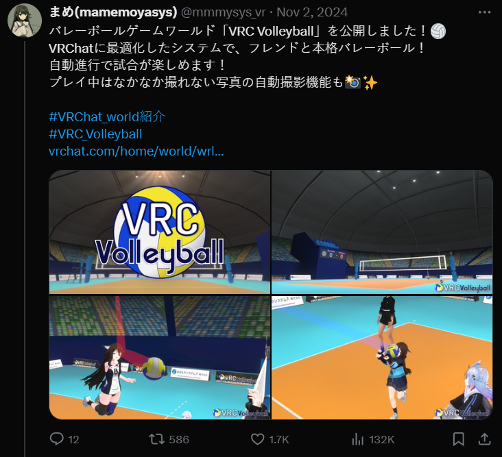
I've played this volleyball game in vrchat with my friends and it was super fun !
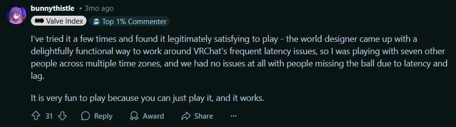
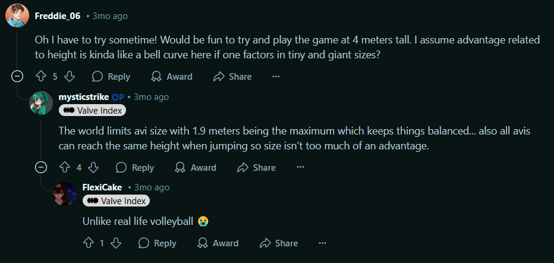
-> usually games in vrchat have a latency issue but the creator found solutions that worked really well. I will need to find similar tricks for my game to work on VRchat.
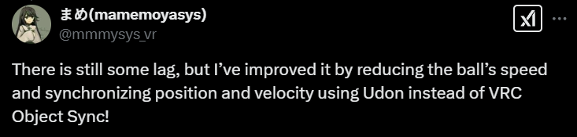
That's what the creator said when I asked her on twitter.

[Back to navigation](#navigation)

 
 

###### 2025-02-04
## //Alternative idea//
After the discussion with Douglas an other project idea came up and I'm just putting it here for reference.

The idea would be to start from specific muscle training movements, and make VR mini-games around those moves, 1 game per 1 training exercise. also would be cool to do that with rehabilitation.
An other way to gamify exercising...

Anyway moving on !

[Back to navigation](#navigation)

 
 

###### 2025-02-13
## VRChat Water study

I looked around in VRChat worlds at how people have made swimming more immersive.

Video link:

[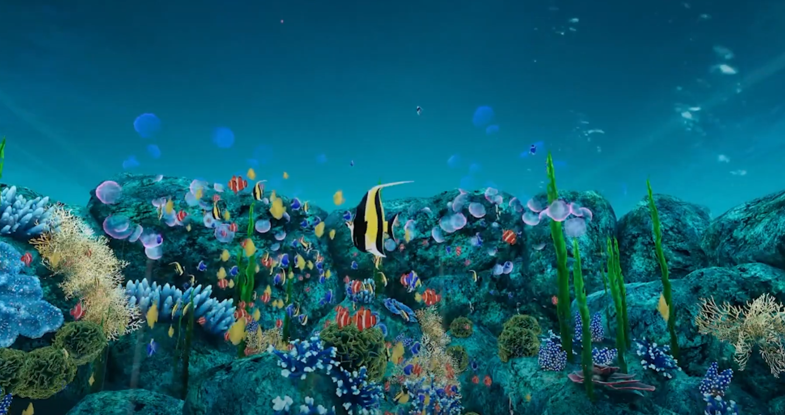](https://www.youtube.com/watch?v=jfafK-0OhEc)

Notes:
- blur at distence
- atmospheric color (whiter/bluer at distence) / blue tint
- CAUSTICS ! (light textures)
- light beams
- water noises
- muted/ echoey voices
- whale noises and such in the background
- lots of small fish swimming randlomly
- tall weed
- corail and sea plants
- Jellyfish !
- big rays
- splach noises, when swiming or jumping in water
- tiny bubbles when moving
- bubbles coming up from the sand
- slow movements, in the plants and particules

[Back to navigation](#navigation)

 
 

###### 2025-02-20
## Underwater study in lake Geneva

[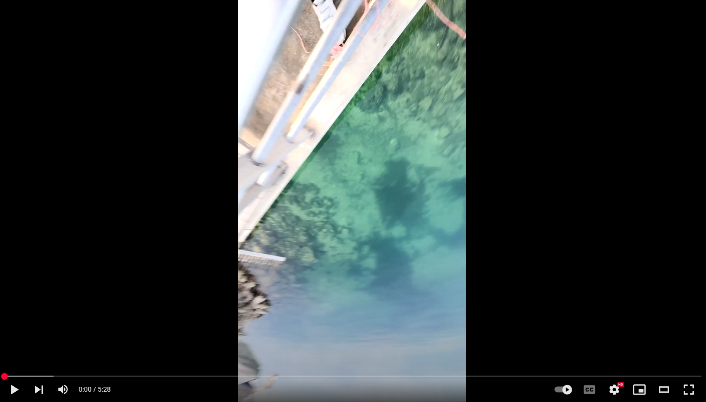](https://youtu.be/TDBmF0spFLU?si=jVobeVIH7IiuPnLj)

I threw my phone in the lake while filming, here are my observations:

### How the Underwater audio feels
Underwater, sound is muted but not weak: strong in the low end but lacking sharpness. It feels engulfing, with no clear direction, as if the sound wraps around you. There’s a thickness to it, like it’s being pushed through a dense medium.

### Recreating Underwater Soundscapes

**Attenuation** - High frequencies fade as sound travels.

**Refraction** - Sound bends due to water temperature and pressure changes.

**Absorption** - High frequencies disappear faster than low ones.

**Impedance mismatch** - Water transmits sound differently than air, altering perception.

**Non-directionality** - Sound seems to come from everywhere.

**Low-pass filtering** - High frequencies are reduced, leaving deep, muffled tones.

**Reverberation** - Continuous, diffused echoes rather than distinct reflections.

### Caustics
it was really cool to see how the caustics look in the real world. you can see how the shape of the water surface bends the light into moving patterns, and the color spectrum.

### Particles
I was able to study how the particles move and show the movement of the water. We can't really see the water movement but i was suprised to see that there are always particles making the flow visible.
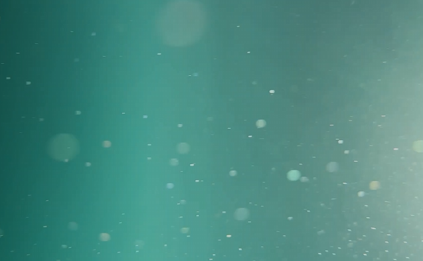

### Reflections
the surface had a reflection of the bottom like a mirror.

### Light beams
The side of the sun had those light beams, subtle but mery much there. it looks beautiful.

### distance fade
in all the scenes without exeptions you can only see what's relatively close, as things ger further they fade into the color of the water.

### Colour swab
$\color{#4AA1BB}{\text{■}}$ blue $\color{#1680A1}{\text{■}}$ bottom blue $\color{#5C95CB}{\text{■}}$ surface blue $\color{#8DBDDB}{\text{■}}$ another surface blue $\color{#8DBDDB}{\text{■}}$ light beams $\color{#59B6BC}{\text{■}}$ murkier waters $\color{#81E5FF}{\text{■}}$ sky blue $\color{#2BC4D8}{\text{■}}$ water blue $\color{#125747}{\text{■}}$ algeas $\color{#627A3F}{\text{■}}$ $\color{#1E3823}{\text{■}}$ other algeas $\color{#589E8C}{\text{■}}$ greenish waters $\color{#59A879}{\text{■}}$ the ground/sand $\color{#54BEAF}{\text{■}}$ water above

$\color{#4AA1BB}{\text{■}}$ $\color{#1680A1}{\text{■}}$ $\color{#5C95CB}{\text{■}}$ $\color{#8DBDDB}{\text{■}}$ $\color{#8DBDDB}{\text{■}}$ $\color{#59B6BC}{\text{■}}$ $\color{#81E5FF}{\text{■}}$ $\color{#2BC4D8}{\text{■}}$ $\color{#125747}{\text{■}}$ $\color{#627A3F}{\text{■}}$ $\color{#1E3823}{\text{■}}$ $\color{#589E8C}{\text{■}}$ $\color{#59A879}{\text{■}}$ $\color{#54BEAF}{\text{■}}$

[Back to navigation](#navigation)

 
 

###### 2025-02-25
## Mid-Crit presentation
*Wednesday 26.02 - 15h20*

### Finball VR: An Underwater Team Sport for Virtual Reality

"Finball VR" is a project focused on developing a new VR swimming locomotion system for a team-based underwater sport.

The goal is to create an immersive and enjoyable experience where players can engage in social, competitive gameplay within a virtual aquatic environment. 

By exploring innovative locomotion techniques and experimenting with DIY physical devices, the project aims to improve the immersion and movement of players. 

Additionally, it will explore the potential of VRChat as a platform for social sports, despite its limitations, allowing for interactions and community. 

The project addresses the challenge of creating a fluid, natural movement system for VR, particularly in team sports settings, as well as designing a new sport specifically with VR’s advantages and limitations in mind.

[Back to navigation](#navigation)

 
 

###### 2025-02-26
## VR physical rigs and other physical devices

[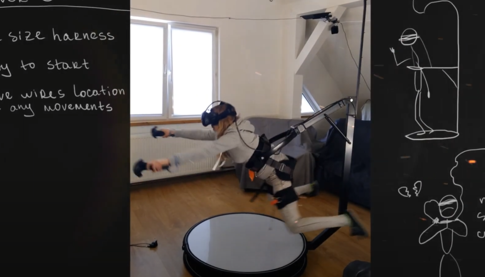](https://www.youtube.com/watch?v=i-OqdQGlMzs)
I've had a lot of interest in VR rigs for a long time but none of them seemed that good.
I don't pretend I could find a solution, but in my case, which is specific to swimming, It would be interesting to design some kind of physical instalation to make the swimming more immersive.

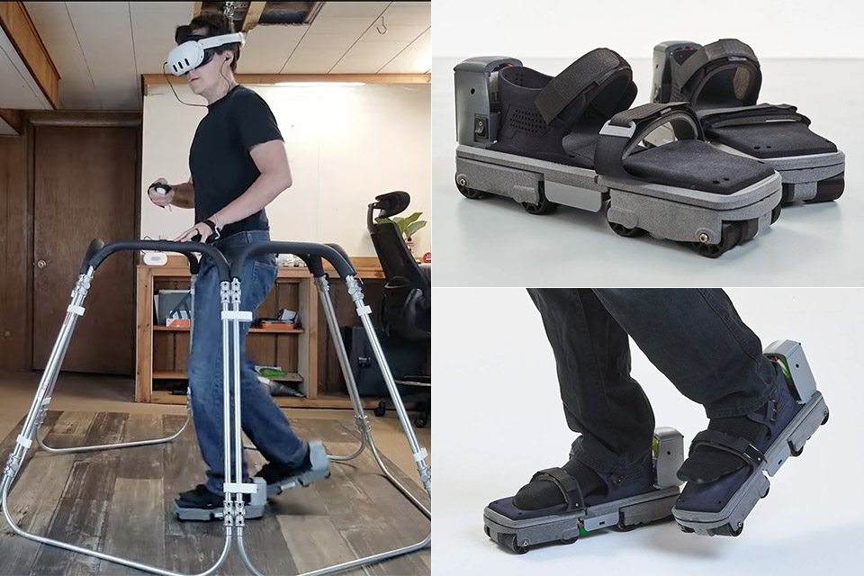
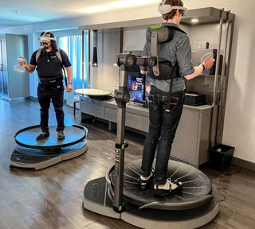
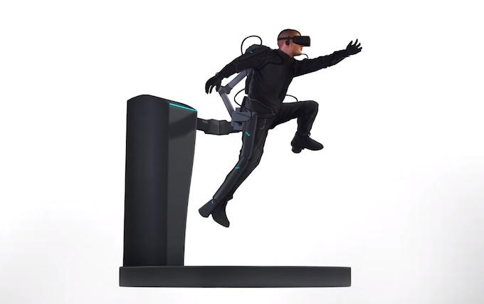
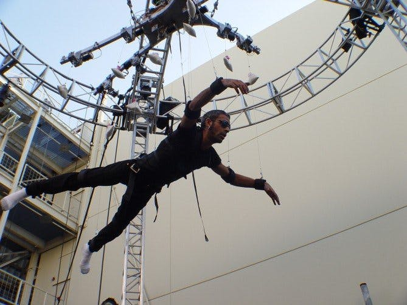

This guy's "weightless machine" would be my dream:
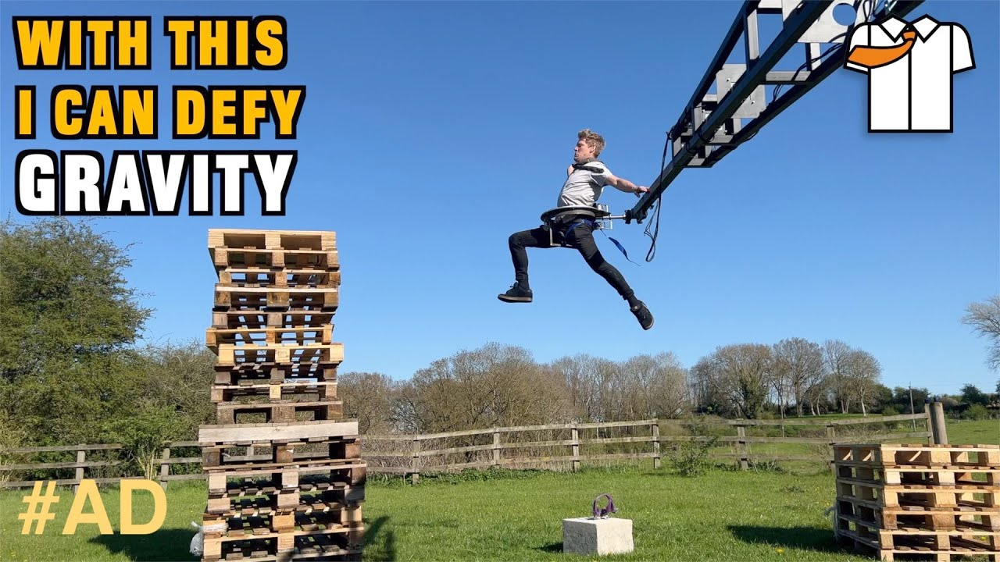

[Link to video](https://www.youtube.com/watch?v=gSDtNkKPiDg)

_______________________
Here are images of physical devices that are used in medical applications such as rehabilitation.

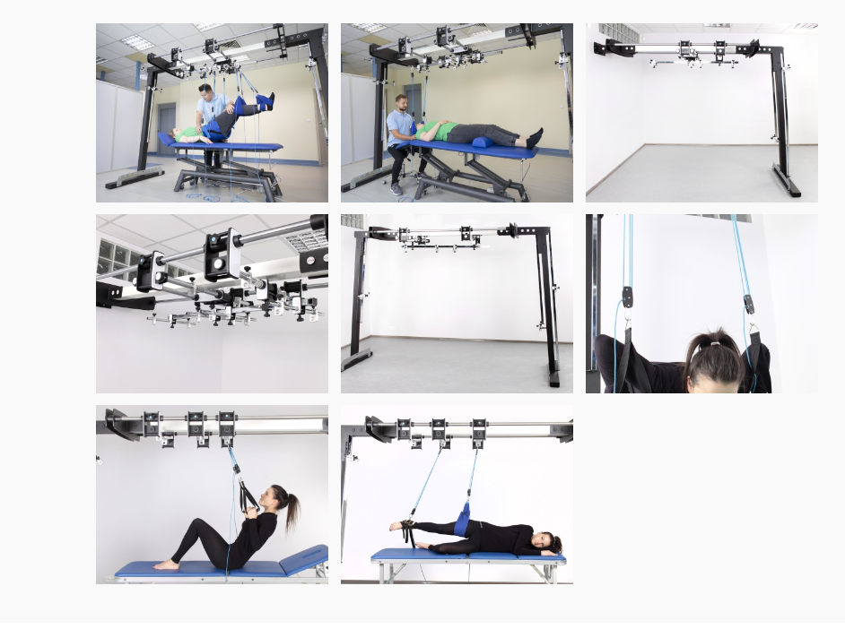
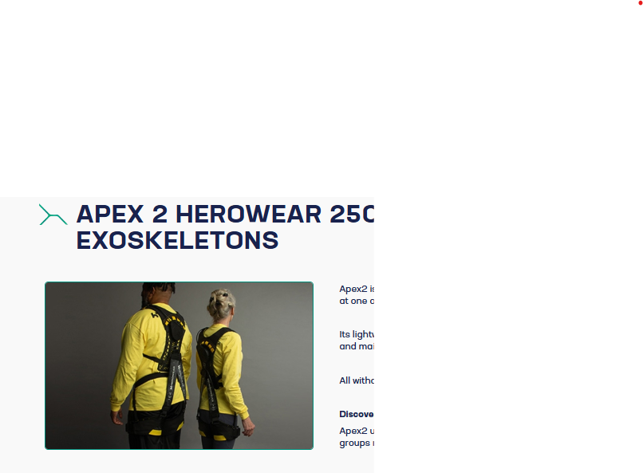
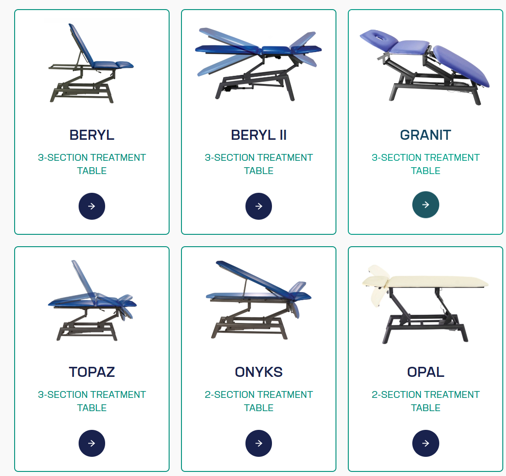
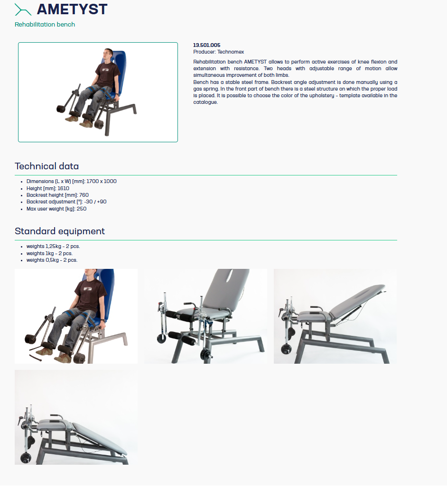
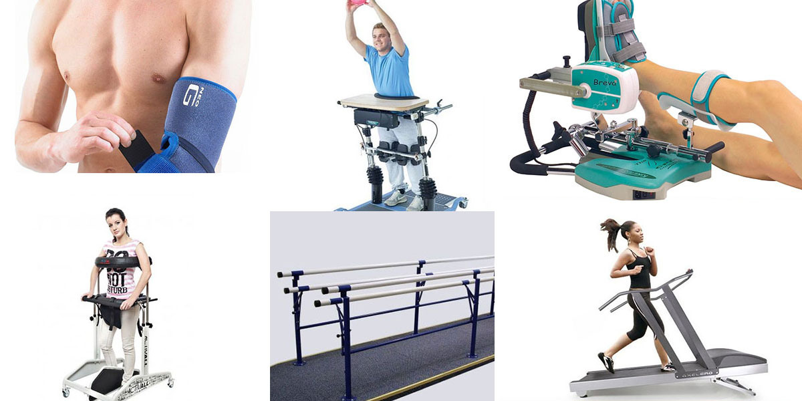

However, i felt uneasy Researching those because some of these people cannot walk or move in real life and im out here trying to move in VR with devices when I could simply do all those movements in real life without aid? Feels a little disrespectful.

And a rig would not be compatible with mass adobtion/accesibility of my game, however it's still interesting to look into. The game should be designer to play without it but should be compatible with it if I get interesting results.

With a rig I would want to add feet trackers but that would be a bother to gear up someone for an exhibition setting. Peharps some other tracking solution could work for this like AI body traking via video, if filming from underneath. it could be part of the device and seamless for users.

A physical device however is also a lot of work and I doubt I could do both the device and the game....

I should focus on the game first.

If I manage to make the game fast and simple I could do the physical stuff :-)

[Back to navigation](#navigation)

 
 

###### 2025-02-
## 