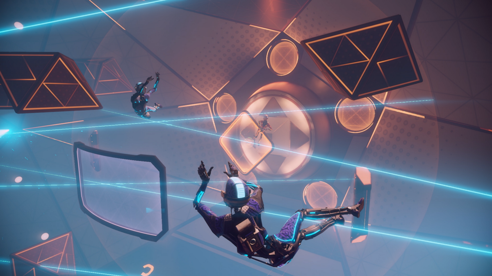
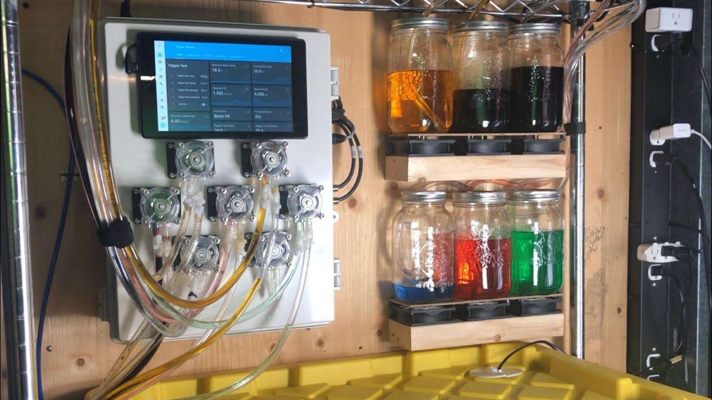
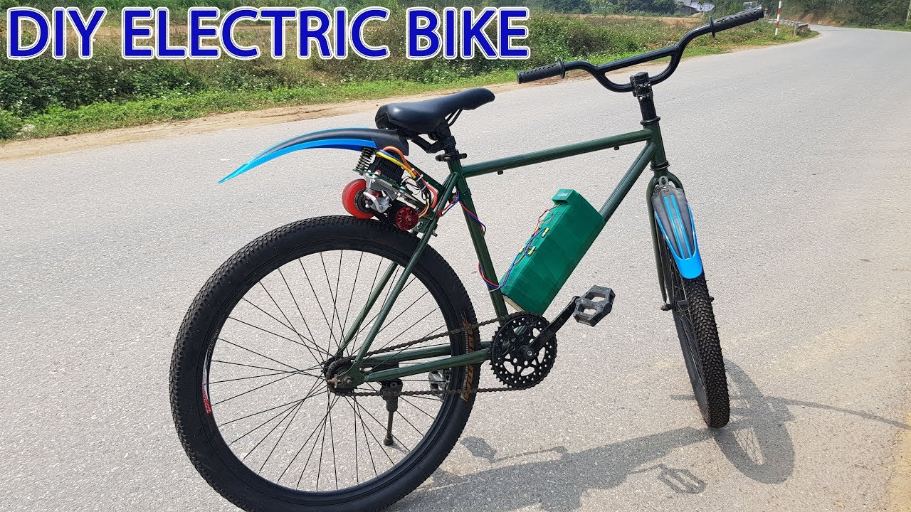
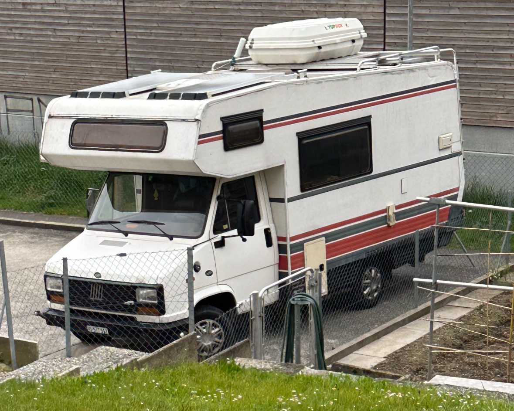

# Master_Work_In_Progress

## Opening presentation

Lauren Thiel

### Loves & Hates

#### 3 references in design and media of things that you love

- VR sport games

- Ecosystems ex: [serpadesign](https://www.youtube.com/watch?v=nRlRPTqnBrU&t=1s)

- Smart devices / automations / diy / building batteries

#### 1 reference of something you hate.

  - webdesign

  

#### 1 chosen studio or practitioner

  - [Augustin Rebetez](https://www.instagram.com/maisontotale_/)

  

#### 1 field of interest or area you would like to explore this year.

  - Designing VR sport games
  - procedural generation ?
